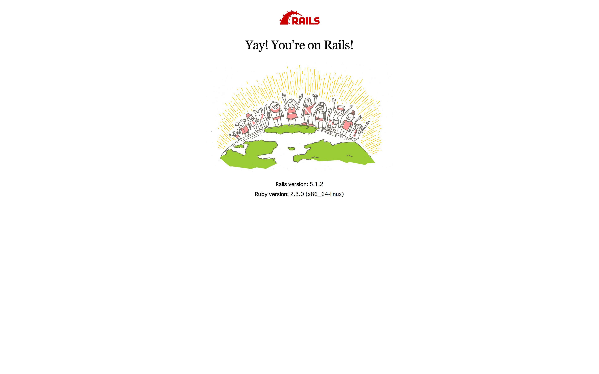

# rails 研修

Ruby on Railsの研修をやって行きましょう。

>Ruby on Rails（ルビーオンレイルズ）は、オープンソースのWebアプリケーションフレームワークである。RoRまたは単にRailsと呼ばれる。その名にも示されているようにRubyで書かれている。
>またModel View Controller（MVC）アーキテクチャに基づいて構築されている。
>実アプリケーションの開発を他のフレームワークより少ないコードで簡単に開発できるよう考慮し設計されている。
>Railsの公式なパッケージはRubyのライブラリやアプリケーションの流通ルートであるRubyGemsにより配布されている。

[参考:wikipedia](https://ja.wikipedia.org/wiki/Ruby_on_Rails)

cakephpをずっとやっていた方は、割ととっつきやすいです。


## 環境構築

まずは環境構築からやりましょう。
今まで、cakephpでは、vagrantを使ってやっていたかと思います。他の仮想環境のツールとして、dockerが挙げられますが、
一旦、vagrantでささっと環境構築しちゃいましょう。

以下のコマンドを実行してください。

参考にしたサイト:[Vagrant 1.8 + CentOS 7 + VirtualBox 5 + Ruby on Rails + Mysqlで開発環境構築](http://qiita.com/SanoHiroshi/items/892a8516f4a6445e1e05)


```shell

# CentOS7のboxを落としてくる(時間かかります)
vagrant box add CentOS7 https://dl.dropboxusercontent.com/s/w3lbekm7eunrskm/centos-7.0-x86_64.box
vagrant init CentOS7
vim Vagrantfile

# # config.vm.network "forwarded_port", guest: 80, host: 8080
# となっている部分のコメントアウトを外して下のように書き換え
# config.vm.network "forwarded_port", guest: 3000, host: 3000

# # config.vm.network "private_network", ip: "192.168.33.10"
# ここのコメントアウトを外す


# 詳しくはVagrantfileをみてください

```

これでvagrantの準備は終わりです。vagrant upしましょう

```shell

vagrant up
vagrant ssh

```

おそらく入れたと思うので、ここから一気にrailsを入れるとこまでやります。
以下のコードでエラーは出ないはずなのですが、万が一エラーはいたら報告をお願いします。

```shell

sudo yum update

sudo yum install -y gcc-c++ patch readline readline-devel zlib zlib-devel libyaml-devel libffi-devel openssl-devel make bzip2 autoconf automake libtool bison git

git clone git://github.com/sstephenson/rbenv.git ~/.rbenv

echo 'export PATH="$HOME/.rbenv/bin:$PATH"' >> ~/.bash_profile
echo 'eval "$(rbenv init -)"' >> ~/.bash_profile

source ~/.bashrc

exec $SHELL -l

git clone https://github.com/sstephenson/ruby-build.git ~/.rbenv/plugins/ruby-build

cd ~/.rbenv/plugins/ruby-build

sudo ./install.sh

rbenv install -l

rbenv install 2.3.0; rbenv rehash
rbenv global 2.3.0

gem install bundler --no-rdoc --no-ri
sudo rbenv rehash
gem install rails
rbenv rehash

sudo yum -y install mariadb-server
sudo yum install ImageMagick ImageMagick-devel

sudo systemctl start mariadb

sudo systemctl enable mariadb

# ここで色々聞かれますが、適当にそれっぽいのを答えておきましょう。
sudo mysql_secure_installation

# mysql -u root -p

sudo yum install mysql-devel
gem install mysql2

sudo systemctl stop firewalld.service
sudo systemctl mask firewalld.service
sudo systemctl list-unit-files | grep firewalld

ruby -v

which gem
which ruby
rails -v
which rails


```


上のコマンドは/sh/sh.shに入っています。
以上のコマンドを実行し終わると、最後に、それぞれのバージョンが表示されます。
最後の5行が、

```shell

# ruby 2.3.0p0 (2015-12-25 revision 53290) [x86_64-linux]
# /home/vagrant/.rbenv/shims/gem
# /home/vagrant/.rbenv/shims/ruby
# Rails 5.1.2
# /home/vagrant/.rbenv/shims/rails

```

こんな感じになっていれば成功です。
これで環境構築は終わりです。


## rails new

まずは、railsのアプリケーションの初期の状態を用意しましょう。
cakephpであれば、ホームページから、zipファイルをダウンロードしてきて、
解凍して、配置して、、、、みたいな手順だったかと思いますが、railsでは

```shell

$ rails new ほにゃらら

```

みたいな感じでアプリケーションを立ち上げます。

```shell

cd /vagrant
rails new railskenshu

# 書式
# rails new appName [option]

```

このコマンドを叩くと大量のファイルが生成されたことでしょう。
次に、bundle install関連をやって行きます。
railskenshu直下に、Gemfileというファイルがあるかと思います。
これは、ライブラリを管理しているもので、多分swiftでいうcarthageみたいな感じです。

今後は、このファイルを更新することで、ライブラリを追加したり管理したりします。

初期状態で結構色々あるかと思いますが、とりあえず

```ruby
gem 'therubyracer', platforms: :ruby
```

これ↑のコメントアウトを外してください。その後


```shell

bundle update
bundle install

```

を行うと、色々読み込まれます。

```shell

rails s -b 0.0.0.0

```

を叩くと、サーバーが動き出します。

ブラウザで[0.0.0.0:3000](http://0.0.0.0:3000/)にアクセスすると、以下のような画面が出るかと思いますが、これで、アプリケーションは立ち上がりました。



では、ここから色々変更して行きます。


## 基本をざっくりと

### routing

railsでは、ルーティングをちゃんと明示しないといけません。
railskenshu/config/routes.rbというファイルでルーティングを管理します。
cakephpでは、コントローラーのメソッド名がそのままURLになるため、ルーティングを明示的に書かなければならない、というのは、慣れないかもしれませんが、そういうものです。慣れましょう。
詳しい記載方法については、後で書きます。

### rails generateコマンド

railsでは、あるファイルを作るときは、自分で作らず、コマンドを叩いて作ります。
この時に使うのが、

```shell

rails g アクション 名前

```

というコマンドです。
cakephpをやっていた人からすると、これは慣れないかもしれませんが、軽く説明します。
例えば、新しいコントローラーを作りたいとき、また、DBの変更をしたい時、新しいモデルを作りたいとき、etc....

こういう時、ついつい自分で新しいファイルを作ってしまったり、sequel proでチョチョっとカラムを追加したりしてしまいがちですね。
しかし、これはダメです。後でめんどくさいことになります。


詳しいことは、

[rails generateコマンドのよく使うコマンドまとめ](http://ruby-rails.hatenadiary.com/entry/20140802/1406948695)

このリンクに書いてあるので、こちらを呼んでください。

よく使うのは、

rails g controller コントローラー名

や、

rails g migration migration名

です。


[rails generate migrationコマンドまとめ](http://qiita.com/zaru/items/cde2c46b6126867a1a64)

この記事を読めば(新しくmigrationを作るたびに見返せばいい)、なんとかなります。

migrationを作成したら、そのmigrationを実行するまでは、アプリケーションは動かなくなります。

「まだ実行されていないmigrationがあるよ」的なエラーが出るので、

```shell

rails db:migrate

```

を実行してください。DBが更新されます。
また、記事内では、rake dg:migrateとなっていますが、rails 5は、rails db:migrateでも動くので、統一しちゃいましょう。

このコマンドを実行すると、schema.rbというファイルも更新されるのがわかるかと思いますが、これは、すべてのmigrationの結果(つまり現在のDBの状態)のファイルだと考えてください。
migrationは、更新のたびに新しいファイルが作られていき、それの積み重ねでDBが完成しています。これは、なんとなく、gitっぽい感じで捉えておけば大丈夫です。


### 命名規則

railsでは、名前のルールが結構厳格です。

下の記事を見るとわかると思いますが、クラス名やファイル名によって、様々な記法があります。その都度調べてからやりましょう。
これを適当にやってしまうと、「あってるはずなのに動かない」状態になります。毎回、気をつけましょう。

[Railsにおける命名規則](http://qiita.com/gakkie/items/3afcd505c786364aa5fa)


